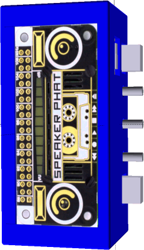
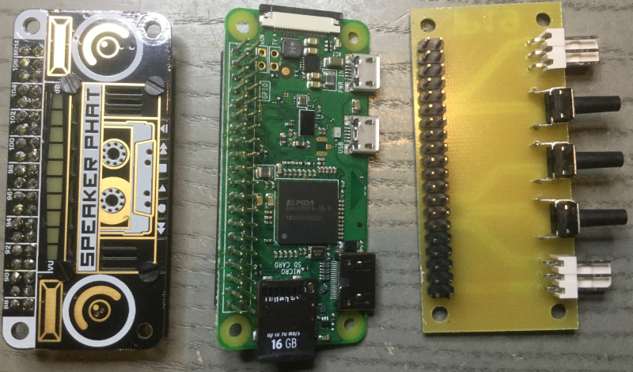

A Jukebox based on Raspberry PI Zero, Pimoroni Speaker PHAT and a PCB with 2 Inputs and 3 Buttons.

A Node JS Web server reacts on a Button click and plays a MP3 file. Additionally is serves an
Angular Web Page to upload MP3 files and configure which button plays which file.

The Jukebox in the 3D printed Case. On Input 1 a photo sensor is connected.

Here the Case and THe stack of 3 PCB's:

And the separated PCB's from top:

and from bottom:

image::img/jukebox4.png[align="center"]
